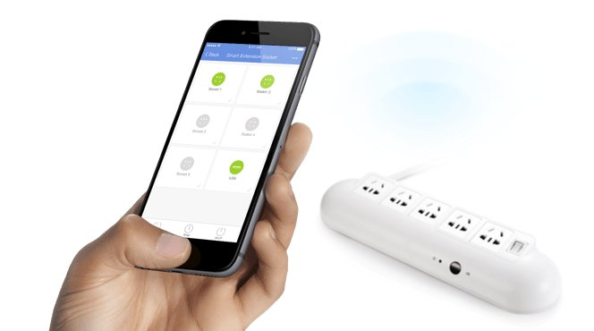

# Tuya Smart Plug API (.NET Standard 2.0)

This .NET Standard 2.0 API allows programmatic control over the basic functions of Tuya Smart Plugs, including getting and setting Power status.



## Requirements
* .NET Core 2.0

## Known-working devices:
* [Zentec Living Smart Plug Outlet with USB Port](https://www.amazon.com/gp/product/B074YGV2NK)
* [ISELECTOR Mini Smart Plug](https://www.amazon.com/gp/product/B075XL3DRD)
* [Xenon Smart Plug PW701U](https://www.amazon.com/Xenon-PW701U-Socket-Outlet-Android/dp/B06W55BTV5)
* [Teckin Smart Plug SH-SP23-2-UK](https://www.amazon.co.uk/gp/product/B07CVJYV3G)

Many Smart Plug devices compatible with the Tuya Smart Life and Jinvoo Smart app also appear to be compatible with the Tuya protocol.

## Installation
```powershell
Install-Package m4rcus.TuyaCore
```

## Retrieving Tuya Plug ID and LocalKey values:
1. Install the [Tuya Smart Life](https://play.google.com/store/apps/details?id=com.tuya.smartlife) App onto your device
1. Install ADB on your computer: https://www.xda-developers.com/install-adb-windows-macos-linux/
1. Ensure your device has USB debugging enabled
1. Plug device into your computer
1. Run filtered ADB logcat via shell:
   ```powershell
   > adb shell
   > logcat | grep BindDeviceSuccessPresenter
   ```
1. Add the smart plug in the Tuya App, monitor the adb logcat output for the following
1. Find the "localKey" and "devId" keys listed in the output, ex:
   ```
   12-06 23:58:53.544 17782 17782 D Tuya    : BindDeviceSuccessPresenter updateList devIds:[{"ability":0,"attribute":0,"bv":"5.06","cloudOnline":true,"devId":"0120015260091453a970","encrypt":false,"gwType":"s","i18nTime":0,"iconUrl":"https://images.tuyaus.com/smart/icon/1496461963_0.jpeg","isLocalOnline":false,"isOnline":true,"lat":"","localKey":"5f5f784cd82d449b","lon":"","name":"WiFi Plug ","pv":"2.1","rnFind":false,"runtimeEnv":"prod","supportGroup":false,"switchDp":0,"time":1512626328,"uuid":"0120015260091453a970","verSw":"1.0.4"}]
   ```
   In this example, the LocalKey is `5f5f784cd82d449b` and the Id is `0120015260091453a970`
1. Find the IP address of your device via your router's DHCP leases. The IP address reported by the app is not the local IP address.
   
## Usage

### Console utility

```Powershell
> dotnet m4rcus.TuyaCore.Console.dll -i <ip> -k <localKey> -d <deviceId> [status|power-on|power-off]
```

### Querying status, toggling power (async)

```C#
using m4rcus.TuyaCore;
```

```C#
var device = new TuyaPlug()
{
    IP = "192.168.0.101",
    LocalKey = "5f5f784cd82d449b",
    Id = "0120015260091453a970"
};
var status = await device.GetStatus();
await device.SetStatus(!status.Powered); // toggle power
```

## Credits

Protocol details from @codetheweb and @clach04:
* https://github.com/codetheweb/tuyapi
* https://github.com/clach04/python-tuya/wiki
